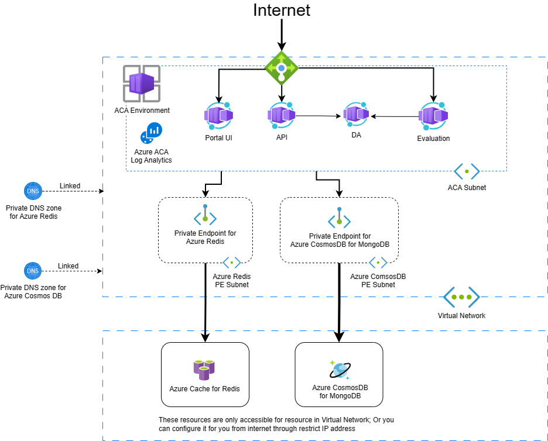

# Deploy FeatBit on Azure using Terraform

This repo contains terraform code for deploying FeatBit on Azure. FeatBit is a feature flag service that helps you manage feature flags and evaluate them in real-time. You can find more information about FeatBit in [FeatBit official website](https://www.featbit.co/) and [Github Repo](https://github.com/featbit/featbit).



As shown in the figure above, FeatBit's services are deployed as Azure Container Apps (ACA) in Azure. Such as FeatBit's UI portal, FeatBit's API server, FeatBit's evaluation server, FeatBit's DA server. Evaluation service and API service communicate with DA service inside ACA.

> Note: ACA is actually a managed Kubernetes cluster. You can find more information about ACA in [Azure Container Apps official document](https://docs.microsoft.com/en-us/azure/container-apps/). 

All services are located in an Azure VNet, we use private endpoint and private DNS zone to secure the access to Azure Cache for Redis and Azure CosmosDB for MongoDB. You can find more information about private endpoint and private DNS zone in [Azure official document](https://docs.microsoft.com/en-us/azure/private-link/private-endpoint-overview).

FeatBit's UI portal, API server and Evaluation server are exposed to the public internet through an Azure Load Balancer and Azure IP addresses. You can find more information about Azure Load Balancer in [Azure official document](https://docs.microsoft.com/en-us/azure/load-balancer/load-balancer-overview).

## Azure Getting Started


If you're not familiar with Terraform Azure Provider, you can follow the steps in the [official Azure Provider tutorial](https://developer.hashicorp.com/terraform/tutorials/azure-get-started/azure-build).

## Deploy FeatBit to your Azure

```bash
# run terraform init to download the required providers
terraform init

# run terraform plan to see what will be deployed
terraform plan

# run terraform apply to deploy FeatBit to your Azure
terraform apply
```

Before applying the Terraform deployment, you can modify variables defined in variables.tf files to customize your deployment. For example, you can

- Change the name of the resource group by changing the value of the `resource_group_name` variable in the `variables.tf` file in the `terraform` directory.
- Change the name of the resources location by changing the value of `location` variable in the `variables.tf` file in the `terraform` directory.
- Change the redis configuration by changing the value of `redis` variable in the `variables.tf` file in the `terraform` directory.

To change cpu, memory, number of replicas of each container app, you currently have to edit directly in the `main.tf` file in the `terraform/aca` directory. We will add these variables in the future to make installation easier.

## Initialize Cosmos DB

After the deployment is finished, you need to initialize database with some data.

###  Seed data

Please copy and run [this script](https://github.com/featbit/featbit/blob/main/infra/mongodb/docker-entrypoint-initdb.d/init.js) again your CosmosDB.

### Create index

Due to compatiblity issues with MongoDB, we need to manually add some indexes to Cosmos DB, please follow [this link](https://docs.featbit.co/installation/faq#use-featbit-with-azure-cosmos-db)


## Run FeatBit

Once all services have started, you can access FeatBit's portal with public URL generated by ACA and log in with the default credentials:

- Username: test@featbit.com
- Password: 123456

## Important Notes

The Terraform code is actually only for the FeatBit Standard version. [Click here to see the difference between Standard and Pro version](https://docs.featbit.co/tech-stack/standard-vs.-professional)

For Pro version, high availability solutions, or any other questions, you can contact us by creating an issue, joining our [Slack channel](https://join.slack.com/t/featbit/shared_invite/zt-1ew5e2vbb-x6Apan1xZOaYMnFzqZkGNQ), or emailing us at [support@featbit.co](mailto:support@featbit.co).
